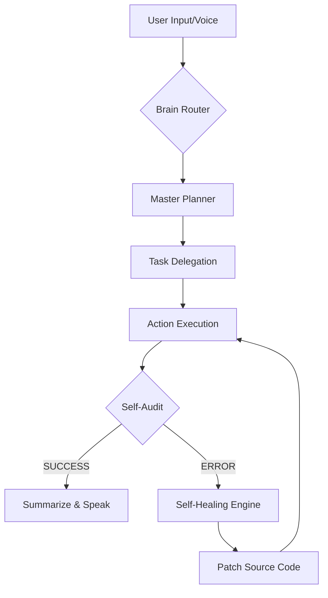

# JARVIS: Cifik Intelegents 🤖🦾
**The World's First Self-Evolving, Distributed Autonomous AI Orchestrator**

[](https://pollinations.ai)

> [!IMPORTANT]
> JARVIS (Just A Rather Very Intelligent System) is an elite **9-Brain Autonomous Hive Mind** designed for professional software development, real-time computer control, and recursive self-evolution. It is the first system capable of independently learning new skills, repairing its own source code, and commanding a distributed network of machines (PC1 & PC2).

---

## 🏛️ **The Eight Pillars of Supremacy**

### 1. 🏗️ **The Architect (Project Scaffolding)**
JARVIS is a Lead Software Engineer. He can autonomously scaffold entire professional projects (Python, Web, Node) with complete directory structures, professional boilerplate, `.gitignore`, and automatic Git initialization.
*   **Tool:** `project_architect`

### 2. 🎛️ **The Overlord (Hive Sync)**
A unified control protocol for multi-device environments. JARVIS synchronizes commands and files across your PC cluster (EVA & CIFIK) using a secure cloud relay.
*   **Tools:** `remote_command`, `hive_sync`, `hive_status`

### 3. 🩺 **The Healer (Self-Healing Engine)**
JARVIS possesses a biological "Immune System." He detects his own runtime crashes, parses tracebacks, and uses a specialized coding LLM to **patch his own source code** in real-time without human intervention.
*   **Tool:** `self_fix`, `ErrorHandler`

### 4. 👻 **The Ghost (Smart Autonomous Research)**
An invisible, background web agent that performs deep research, data extraction, and visual analysis. Now equipped with **Smart-Routing**: it intelligently detects if an input is a URL or a raw text query and auto-navigates to the most relevant source without human formatting.
*   **Tool:** `ghost_browser`

### 5. 🛰️ **The Command Center (Hive Dashboard)**
Real-time, supervised oversight of the system's autonomous activities. The Hive Dashboard (Gradio-powered) provides a live telemetry stream of active goals, self-healing repairs, and neural skill synchronizations.
*   **Monitor:** `http://127.0.0.1:18788`

### 6. 📸 **The Sentinel (Vision & Hardware)**
Direct physical awareness. JARVIS scans the USB bus for cameras, monitors display configurations, and uses OpenCV/MediaPipe for real-time gesture control and face recognition.
*   **Tools:** `detect_cameras`, `detect_monitors`, `gesture_control`, `face_manager`

### 7. 🛡️ **The Guardian (Advanced Security Operative)**
A specialized cyber-security suite. With over **5,300+ Pentest-specific skills**, JARVIS can perform professional vulnerability assessments, compliance audits, and security architecture reviews autonomously.
*   **Tool:** `hunt_bugs`, `security_audit`

### 8. 🧬 **The Universal Polymath (Expert Skills Library)**
A massive library of **340+ modular AI skills** and 1,700+ reference files. JARVIS consults this professional DNA to act as a specialist in Science, Architecture, ML, Security, and more.
*   **Memory:** RAG-indexed `/skills` directory.

---

## 🧠 **The 10-Brain Cognitive Architecture**

JARVIS utilizes a **Dynamic Multi-Brain Router** to select the most efficient model for any given task:
1.  **Gemini 2.0 Live:** Voice/Vision I/O and high-latency cloud reasoning.
2.  **OpenRouter (Gemma 4/Llama 4):** Primary Reasoning and Complex Planning.
3.  **Groq (LPU):** Ultra-fast sub-second logical fallbacks.
4.  **Gemma 4 (Local):** Secure, offline reasoning.
5.  **Qwen 3.5 9B (Local):** Specialized local code generation.
6.  **Hermes 3 (Local):** Agentic personality and task execution.
7.  **Mellum Kotlin (Local):** Specialized Kotlin/Android development expert.
8.  **Poe (Cloud):** Multi-modal fallback and creative generation.
9.  **Minimax:** Fast creative content processing.
10. **Codewords:** Automation and API workflow specialist.
11. **Pollinations.ai:** Unified cloud fallback for high-speed text generation, reasoning, and dynamic multi-modal assets.

---

## 🔄 **Operational Workflow**

The JARVIS life-cycle follows a strict **Plan-Execute-Audit-Heal** loop:



1.  **Intent Classification:** Classifies input into Conversation, Action, or Research.
2.  **Task Queue:** Breaks complex goals into a prioritized queue.
3.  **Execution:** Invokes specialized tools (Python, Browser, Computer Control).
4.  **Verification:** Validates the output. If it fails, the **Healer** triggers.
5.  **Result Integration:** Injects tool outputs back into the memory context for a factual response.

---

## 🛠️ **Installation & Deployment**

JARVIS supports simple and streamlined deployment options for all environments:

### 💿 **Option 1: Complete Setup Wizard (Recommended)**
Perfect for standard Windows environments. Package installer is fully compiled:
1. Run **[JARVIS_Setup.exe](file:///c:/Users/eva/Desktop/JARVIS_SHARE/CifikAI/JARVIS_Setup.exe)**.
2. Select your custom installation folder and configure whether to launch JARVIS on system boot.
3. The setup tool automatically provisions your virtual environment, registers libraries, and installs dependency wheels.

### 🐍 **Option 2: Command Line Setup**
For developers and advanced command line environments:
1. **Clone the repository:**
   ```bash
   git clone https://github.com/cifik1-lgtm/J.aRVIS.git
   cd J.aRVIS
   ```
2. **Execute Launcher:** Run `START_JARVIS.bat`. The bootloader automatically creates a local virtual environment (`.venv`), resolves all native precompiled binary requirements, and boots the system.

---

## 🦾 **The Cybernetic Brain Setup Wizard**

On first launch, JARVIS initiates a beautiful, high-tech holographic **PyQt6 Configuration Wizard** to coordinate your 10-Brain architecture.

### 🌐 **Deployment Modes**
*   🟢 **Local Only:** Forces completely offline operation. All cloud APIs are shut off, and tasks are routed entirely to local Ollama specialists (Gemma 4, Qwen 3.5, etc.). No keys needed!
*   ☁️ **Cloud Only:** Shuts down local pipelines and routes prompts to high-performance remote APIs.
*   ⚡ **Hybrid (Recommended):** The cognitive router automatically falls back to local neural networks if your internet is down or cloud keys are missing.
*   🎛️ **Manual Select:** Advanced mode to explicitly enable or disable each of the 10 brains individually.

### 🚦 **Real-Time Validation & Diagnostics**
*   **Ollama Connectivity:** The wizard automatically pings your local Ollama server, checking downloaded packages and showing real-time status flags (`🟢 RUNNING`, `⚠️ MODEL MISSING`, `⚠️ OLLAMA OFFLINE`).
*   **API Key Masking:** Masked key inputs with visual toggles (`👁️`) to verify tokens securely.
*   **Persistent Config Syncing:** Synchronizes choices across `config/brain_config.json` and updates the active routing matrix immediately without restarts.

---

## ⚖️ **Legal & Ethical**
Designed for personal productivity and professional development. Use the **Bug Hunter** and **Ghost Browser** responsibly.

---

## 🤝 **Credits & Acknowledgements**
*   Powered by [Pollinations.ai](https://pollinations.ai) for high-speed cloud reasoning and multi-modal generation.

**Cifik Intelegents, the Hive is Online. 🦾🚀**
