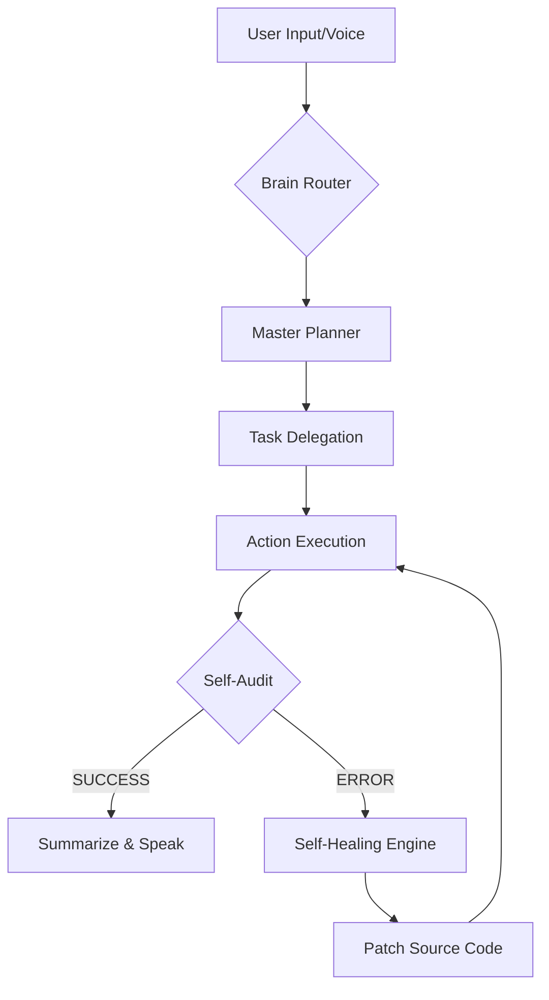

# JARVIS: Cifik Intelegents 🤖🦾
**The World's First Self-Evolving, Distributed Autonomous AI Orchestrator**

> [!IMPORTANT]
> JARVIS (Just A Rather Very Intelligent System) is an elite **9-Brain Autonomous Hive Mind** designed for professional software development, real-time computer control, and recursive self-evolution. It is the first system capable of independently learning new skills, repairing its own source code, and commanding a distributed network of machines (PC1 & PC2).

---

## 🏛️ **The Seven Pillars of Supremacy**

### 1. 🏗️ **The Architect (Project Scaffolding)**
JARVIS is a Lead Software Engineer. He can autonomously scaffold entire professional projects (Python, Web, Node) with complete directory structures, professional boilerplate, `.gitignore`, and automatic Git initialization.
*   **Tool:** `project_architect`

### 2. 🎛️ **The Overlord (Hive Sync)**
A unified control protocol for multi-device environments. JARVIS synchronizes commands and files across your PC cluster (EVA & CIFIK) using a secure cloud relay.
*   **Tools:** `remote_command`, `hive_sync`, `hive_status`

### 3. 🩺 **The Healer (Self-Healing Engine)**
JARVIS possesses a biological "Immune System." He detects his own runtime crashes, parses tracebacks, and uses a specialized coding LLM to **patch his own source code** in real-time without human intervention.
*   **Tool:** `self_fix`, `ErrorHandler`

### 4. 👻 **The Ghost (Smart Autonomous Research)**
An invisible, background web agent that performs deep research, data extraction, and visual analysis. Now equipped with **Smart-Routing**: it intelligently detects if an input is a URL or a raw text query and auto-navigates to the most relevant source without human formatting.
*   **Tool:** `ghost_browser`

### 5. 🛰️ **The Command Center (Hive Dashboard)**
Real-time, supervised oversight of the system's autonomous activities. The Hive Dashboard (Gradio-powered) provides a live telemetry stream of active goals, self-healing repairs, and neural skill synchronizations.
*   **Monitor:** `http://127.0.0.1:18788`

### 6. 📸 **The Sentinel (Vision & Hardware)**
Direct physical awareness. JARVIS scans the USB bus for cameras, monitors display configurations, and uses OpenCV/MediaPipe for real-time gesture control and face recognition.
*   **Tools:** `detect_cameras`, `detect_monitors`, `gesture_control`, `face_manager`

### 7. 🛡️ **The Hunter (Security Audit)**
An autonomous security operative. JARVIS can clone GitHub repositories and perform full security audits (SQLi, XSS, etc.), verify vulnerabilities with LLMs, and create patches automatically.
*   **Tool:** `hunt_bugs`

---

## 🧠 **The 9-Brain Cognitive Architecture**

JARVIS utilizes a **Dynamic Multi-Brain Router** to select the most efficient model for any given task:
1.  **Gemini 2.0 Live:** Voice/Vision I/O and high-latency cloud reasoning.
2.  **OpenRouter (Gemma 4/Llama 4):** Primary Reasoning and Complex Planning.
3.  **Groq (LPU):** Ultra-fast sub-second logical fallbacks.
4.  **Mistral 7B (Local):** Secure, offline reasoning.
5.  **Qwen Coder (Local):** Specialized local code generation.
6.  **Hermes 3 (Local):** Agentic personality and task execution.
7.  **Poe (Cloud):** Multi-modal fallback and creative generation.
8.  **Minimax:** Fast creative content processing.
9.  **Codewords:** Automation and API workflow specialist.

---

## 🔄 **Operational Workflow**

The JARVIS life-cycle follows a strict **Plan-Execute-Audit-Heal** loop:

1.  **Intent Classification:** Classifies input into Conversation, Action, or Research.
2.  **Task Queue:** Breaks complex goals into a prioritized queue.
3.  **Execution:** Invokes specialized tools (Python, Browser, Computer Control).
4.  **Verification:** Validates the output. If it fails, the **Healer** triggers.
5.  **Result Integration:** Injects tool outputs back into the memory context for a factual response.

---

## 🛠️ **Installation & Deployment**

### Prerequisites
- **OS:** Windows 10/11 (Optimized for Multi-Monitor & AMD GPU)
- **Hardware:** AMD RX 580 (Vulcan/DirectML) or NVIDIA equivalent.
- **Python:** 3.10+

### Setup
1. Clone the repository: `git clone https://github.com/cifik1-lgtm/J.aRVIS.git`
2. Install dependencies: `pip install -r requirements.txt`
3. Configure API keys in `config/api_keys.json`.
4. Run the Core: `python main.py`

---

## ⚖️ **Legal & Ethical**
Designed for personal productivity and professional development. Use the **Bug Hunter** and **Ghost Browser** responsibly.

**Cifik Intelegents, the Hive is Online.** 🦾🚀
